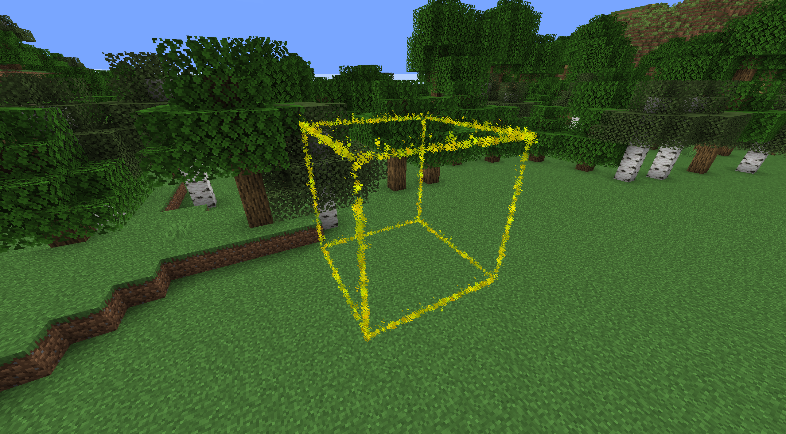

[](https://jitpack.io/#funnyboy-roks/DrawLib)

# DrawLib

A simple library to draw some simple shapes using particles in Paper servers



## Maven

Add jitpack to your `repositories`:
```xml
<repository>
    <id>jitpack.io</id>
    <url>https://jitpack.io</url>
</repository>
```

Add DrawLib to your `dependencies`:
```xml
<dependency>
    <groupId>com.github.funnyboy-roks</groupId>
    <artifactId>DrawLib</artifactId>
    <version>1.1.0-SNAPSHOT</version>
</dependency>
```

For other tools, see the [JitPack](https://jitpack.io/#funnyboy-roks/DrawLib) page

## Usage

```java
ShapeRenderer renderer = new ShapeRenderer();

renderer.setColor(Color.RED);
renderer.setStepSize(0.1);
renderer.setReceivers(player);
renderer.drawLine(point1, point2);
```

## Current Shapes

- Point
- Line
- Cuboid
- Sphere
